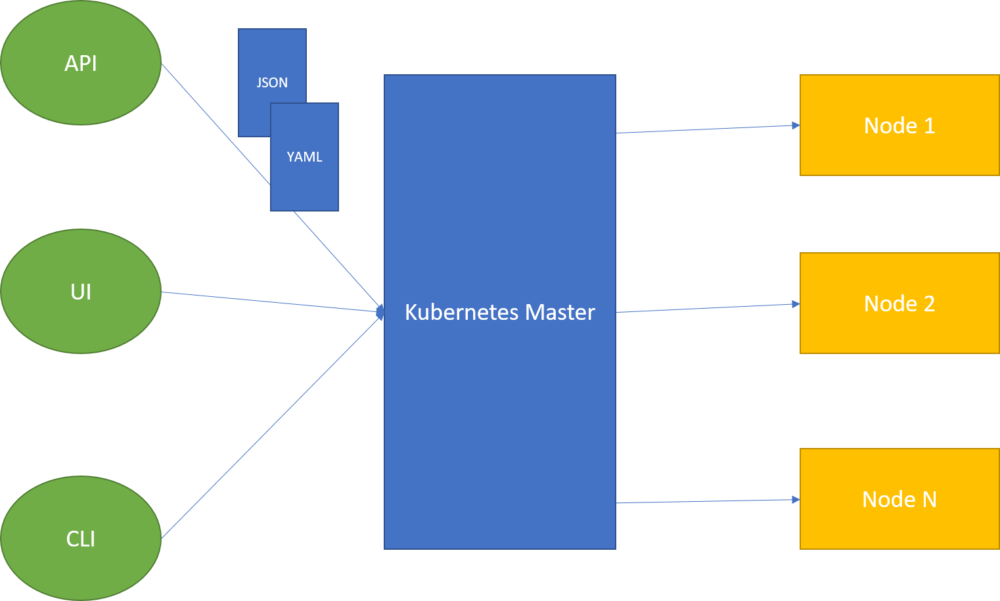

# Getting started with Kubernetes

Kubernetes is a tool that takes linux containers and deploy them in distributed system. So you can run large number of containers in production and scale them up. It supports multiple cloud providers as AWS, Azure, Google Cloud Platform ...etc

Linux container is packaging mechanism, it provides to developers many powerful features as portability, isolation, security...

Docker has solved the problem of packaging, deploying and running containerized applications. It's great for managing few containers running on a fewer machines.

Production applications deal with dozens of containers running on hundreds of machines.

Docker is a phenomenal tool for managing and running one or multiple containers on one host

## Cluster Manager / Orchestration Engine

- Docker Swarm
- Kubernetes
- Mesossphere OS/DC

## What is Kuberenetes ?

- Open source project inspired from an internal Google project called Borg (subset of it)
- Decouples applications from machines through containers
- APIs for deployment workflows:
  - Rolling updates
  - Canary deploys
  - Blue-green deployments
  
## Kubernetes Architecture

Master-Slave design, the user submit the container definition (in YAML or JSON file) to the master through:

- API
- UI
- CLI

The container definition container the image container, constraints, affinity, ports, volumes ...etc

## Setup & configure Kuberenetes

- Minikube: simplest way to get Kubernetes cluster up and running
- Kubernetes Multi-Node Cluster: emulates production environment
- Google Container Engine

## Kubernetes Terminology

- Nodes: hosts that run kubeneretes applications
- Containers: Units of packaging
- Pods: Units of deployment (collection of container)
- Replication Controller: ensures availability and scalability
- Labels: Key-Value pairs for identification
- Services: collection of pods exposed as an endpoint

## List of commands

| Command        | Description  |
| ------------- |:-------------:|
| kubectl get nodes      | get list of nodes |
| kubectl get cs      | components health      |
| kubectl get pods | list of pods |
| kubectl config use-context "vagrant multi" | switch kube control to another cluster |
| kubectl expose deployment name --target-port= --type=NodePort | create a service |
| kubectl get services | get list of services |

## Kuberentes Master

- apiserver:
- scheduler:
- controller-manager:

## Kuberenetes Node

- kubelet: agent to interact with master and report health status & metrics to etcd
- kube-proxy: distributed network
- docker: linux container engine (see rkt)

### POD

- Group of one or more containers that are always co-located, co-scheduled and run in a shared context
- Each pod is isolated by:
  - process id namespace
  - network namespace
  - interprocess communication namespace
  - unix time sharing (uts) namespace
  
### Labels & Selectors

Assign meta-data

### Services

An abstraction to define a logical set of Pods. Services are exposed through internal and external endpoints

- Cluster IP: available only in the cluster
- NodePort: external service

### Replication Controller

Ensures that a Pod or set of Pods are always up and available, it always maintains desired number of Pods

## Deploy a 3-tier application

- Each pod gets a virtual IP (dynamic ip address)
- Service is kind of a proxy, with a fixed virtual ip address
- Each component deployed as a pod
- We use services for component communication

_________

- K8S: schedules, run and manage containers on a cluster of virtual or physical machines

- Pods:
smallest deployable unit
small group of tighty coupled containers
shared network and data volumes
routable IP address
mortal

- ReplicaSets:
run x copies (replicas) of a pod
start or kill pods if necessary
handle pod failures (health check)

- Deployments
contains declaration of your application:
  image
  env variables
  data volumes
define number of replicas
creates ReplicaSet, which in turn create Pods

- Services
provide a permanent virtual IP and DNS name
proxy traffic to selected pods
simple load balancing including session affinity

- Ingress
expose services to the outside world
map URLs to services
SSL termination
needs ingress provider

- Namespaces
group kubernetes resources
by default everything is in the default namespace
create namespace for you env (test, staging, production)
restrict access to specific namespaces for k8s users
namespaces can have separated networks

- Clusters
a cluster is a set of virtual or physical machines (nodes) running a k8s master and one or more k8s worker nodes
cluster federation:
  run a federation master, which knows all your clusters
  run your apps distributed across clusters, across amazon/google/...regions
  
- Secrets & ConfigMaps
seperate your application code and configuration
both Secrets & ConfigMaps are key-value-pairs
use Secrets for binary values (certificates, keys)
use ConfigMaps for string values
both can be read by the container via env variables or mapped into a data volume

- Data Volumes
map directories into containers
multiple containers in one pod share the same volumes
many volume types: host directory, empty directory, google persistent disk, amazon blob store, nfs, rdb, git, cephs ..

- PetSets
a Pet is a stateful pod
a PetSet has a scalable number of Pets
a Pet is bound to a dynamically created data volume
that data volume will never be deleted automatically
the Pet is bound to the same volume on a restart

- Jobs
sometimes you need to run short living tasks
a job ensures that a container which executes such a task runs successfuly exactly once
retry on failure
ScheduledJobs can be started a specific times (like cron)

- DaemonSets
run pods on all (or a selected set of) nodes in the cluster
useful for running containers for logging and monitoring

- Autoscaling
Horizonal Pod autoscaling: scales replicasets 
Cluster Autoscaling: scale the number of nodes

- API
command line tool "kubectl"
easy intergration in your existing workflow

- Replication Controller's Selector matches the Pods based on Labels

### Service Discovery

- SD through Env variables
- SD through DNS
- Service Types:
  - Cluster IP
  - NodePort
  - LoadBalancer

